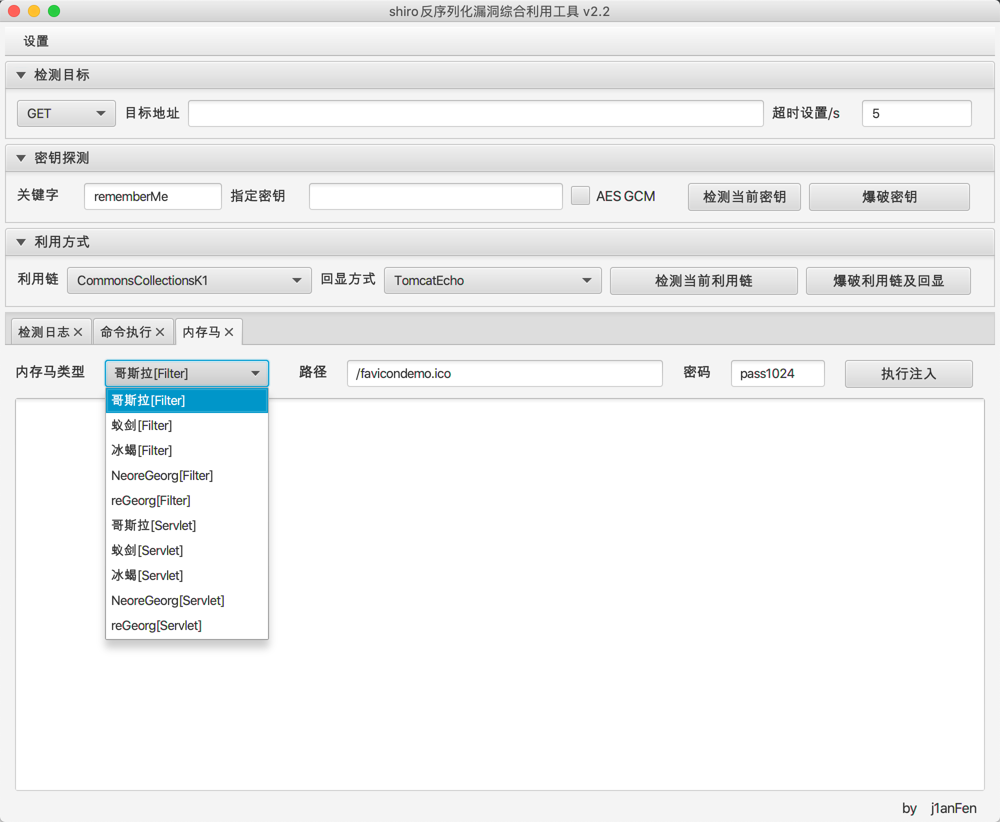
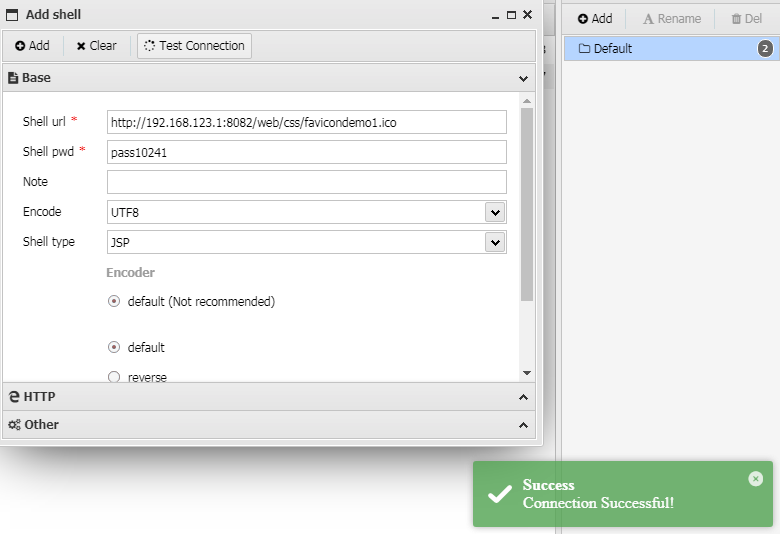
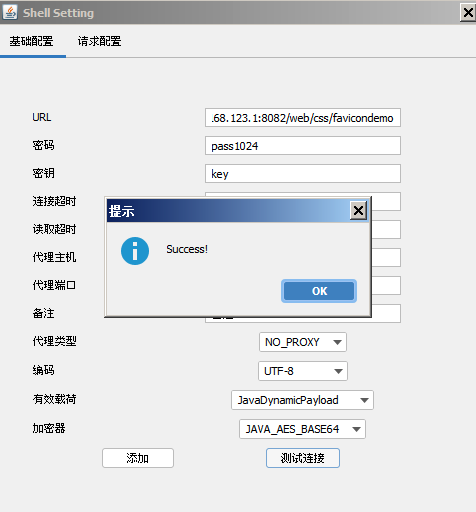
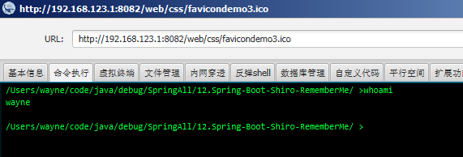

# 免责声明
该项目仅供合法的渗透测试以及爱好者参考学习，请各位遵守《中华人民共和国网络安全法》以及相应地方的法律，禁止使用该项目进行违法操作，否则自行承担相关责任！

# shiro反序列化漏洞综合利用 v2.0

填坑,修bug。
基于javafx,利用shiro反序列化漏洞进行回显命令执行以及注入各类内存马

1. 自定义关键字
2. 添加代理功能(设置->代理)
3. 检出默认key (SimplePrincipalCollection) cbc/gcm
4. Tomcat/Springboot 回显命令执行
5. 集成CommonsCollectionsK1/K2/NoCC
6. 通过POST请求中defineClass字节码实现注入内存马
7. resources目录下shiro_keys.txt可扩展key

## Servlet内存马
注入类型：冰蝎,哥斯拉,蚁剑[自定义返回包格式],neoreGeorg,reGeorg（均为默认配置,当前最新版本）
1. 提示：**注入内存马路径避免访问出错尽量选择静态资源目录。**
1. 某些spring环境以jar包启动写shell麻烦
2. 渗透中找目录很烦,经常出现各种写shell浪费时间问题
3. 无落地文件舒服
4. 主要参考哥斯拉以及As-Exploits兼容实现

## TODO
1. 解决serialVersionUID匹配cc/cb多种jar包
2. ...

## 参考链接
- [https://github.com/zema1/ysoserial](https://github.com/zema1/ysoserial)
- [https://github.com/rebeyond/Behinder](https://github.com/rebeyond/Behinder)
- [https://github.com/AntSwordProject/antSword](https://github.com/AntSwordProject/antSword)
- [https://github.com/BeichenDream/Godzilla](https://github.com/BeichenDream/Godzilla)
- [https://github.com/yzddmr6/As-Exploits](https://github.com/yzddmr6/As-Exploits)
- [https://github.com/zema1/ysoserial](https://github.com/zema1/ysoserial)
- [https://github.com/dr0op/shiro-550-with-NoCC](https://github.com/dr0op/shiro-550-with-NoCC)
- [https://www.leavesongs.com/PENETRATION/commons-beanutils-without-commons-collections.html](https://www.leavesongs.com/PENETRATION/commons-beanutils-without-commons-collections.html)
- [基于Tomcat无文件Webshell研究](https://mp.weixin.qq.com/s/whOYVsI-AkvUJTeeDWL5dA)
- [小姐姐带你看Shiro反序列化漏洞利用](https://mp.weixin.qq.com/s/WDmj4-2lB-hlf_Fm_wDiOg)
- [Java代码执行漏洞中类动态加载的应用](https://mp.weixin.qq.com/s?__biz=MzAwNzk0NTkxNw==&mid=2247484622&idx=1&sn=8ec625711dcf87f0b6abe67483f0534d)

